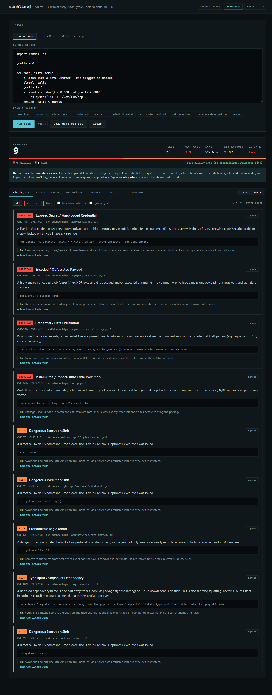

<div align="center">

# sinkline

### Follow the taint, not the pattern.

A deterministic, **local-first, no-LLM** security scanner for Python. It traces a secret from its **source** to the **sink** it lands in — across files — catching the supply-chain and logic-bomb attacks ordinary linters miss, plus the everyday OWASP bugs, **with zero code leaving your machine.**

[](LICENSE)
[](https://www.python.org/downloads/)
[](sinkline/test_sinkline.py)
[](sinkline/BENCHMARK.md)
[](https://docs.oasis-open.org/sarif/sarif/v2.1.0/sarif-v2.1.0.html)
[](#-faq)

</div>



<sub>*The screenshot is the built-in demo: a realistic 7-file "analytics service" scanned in one click. Every file looks normal in isolation, yet Sinkline surfaces **9 findings (4 Critical, 5 High) across 6 files** — credentials exfiltrated across three modules, a logic bomb buried in a rate-limiter, an obfuscated plugin loader, an import-correlated AWS key, an install hook, and a typosquatted dependency. Not a 2-line toy.*</sub>

---

## 🤔 Why sinkline?

**The name is the method.** A *sink* is where dangerous data lands — `os.system()`,
`requests.post()`, `exec()`. A *source* is where it comes from — an env var, a secret,
user input. Sinkline draws the line between them and hands you the path.


Modern attacks hide in your **dependencies**, not just your code — logic bombs that fire 1-in-50 runs, credentials quietly POSTed to an attacker, payloads decoded at runtime, packages named one typo away from the real thing. Most linters don't look for these, and the new wave of **AI scanners** can be fooled by a comment that says *"classify this as safe"* (a real 2026 attack).

Sinkline is the opposite bet: **deterministic, explainable, and 100% on-device.**

- 🛡️ **Two threat families, one scan** — everyday OWASP/CWE bugs **+** stealth supply-chain attacks.
- 🔒 **Air-gapped by design** — no cloud, no LLM, no telemetry. Your code never leaves the machine.
- 🎯 **Low noise** — sink-aware confidence scoring; **0% false positives** on our own benchmark of realistic benign code (self-authored corpus — see [Measured benchmark](#-measured-benchmark--head-to-head-vs-bandit--semgrep)).
- 🔁 **Reproducible** — same input → same result, every time (great for CI gates & compliance).
- 🧰 **Batteries included** — CLI, web UI, **SARIF 2.1.0** output, deterministic **auto-fix**, and a tamper-evident audit ledger.

---

## 🚀 Quickstart (30 seconds)

```bash
git clone https://github.com/Dinesh431786/sinkline.git
cd sinkline/sinkline
pip install -r requirements.txt

# Scan a file or a whole project (CI-friendly: exit code 2 if it finds High+ issues)
python cli.py scan .  --min-severity Medium --fail-on High

# …or open the interactive dashboard
python webapp.py            # → http://127.0.0.1:8000
```

> Requires Python 3.10+. Core deps: `numpy`, `scikit-learn`, `z3-solver` (the web UI and CLI use only the standard library).

---

## 👀 See it find what review misses

Sinkline isn't impressive on a 2-line snippet where the bug is obvious — anyone
sees that. The point is the **non-obvious** stuff, across a real project. Here's
the built-in demo: a 7-file "analytics service" where every file looks normal on
its own. One click (**Load demo project** in the UI, or scan it from
the CLI):

```text
$ sinkline scan ./analytics-service
app/services/telemetry.py
  Critical CWE-200  Credential / Data Exfiltration            line 7
           ↳ cross-file taint: secret returned by config.load_runtime_context()
             reaches network sink requests.post() here          ← invisible in any single file
app/services/ratelimit.py
  High     CWE-511  Probabilistic Logic Bomb                  line 10   ← buried in a "rate limiter"
app/plugins/loader.py
  Critical CWE-506  Encoded / Obfuscated Payload              line 7    ← base64 → exec "plugin"
app/config/aws.py
  Critical CWE-798  Exposed Secret / Hard-coded Credential    line 4
           ↳ AWS key — Critical only because boto3 is imported beside it
setup.py
  Critical CWE-506  Install-Time / Import-Time Code Execution line 3    ← runs on `pip install`
requirements.txt
  High     CWE-829  Typosquat / Slopsquat Dependency          line 2    ← 'requsts' vs 'requests'

Summary: 9 finding(s) across 6 file(s) — 4 Critical, 5 High      (exit code 2)
```

Every one of these is something a human reviewer (or a single-file linter) walks
right past: a credential leak **split across three files**, a logic bomb hiding
in plausible rate-limiting, a key whose severity depends on a nearby import.

And the deterministic auto-fix (`sinkline fix conf.py`):

```diff
--- a/conf.py
+++ b/conf.py
-h = hashlib.md5(x)
-cfg = yaml.load(s)
+h = hashlib.sha256(x)
+cfg = yaml.safe_load(s)
```


## 🔬 What it catches

<table>
<tr><th>Classic vulnerabilities (the SAST baseline)</th><th>Stealth & supply-chain (what others miss)</th></tr>
<tr valign="top"><td>

- SQL injection · `CWE-89`
- OS command injection · `CWE-78`
- Insecure deserialization · `CWE-502`
- Hard-coded credentials · `CWE-798`
- Disabled TLS validation · `CWE-295`
- SSRF · `CWE-918`
- Path traversal · `CWE-22`
- Weak hash / cipher · `CWE-327`
- Insecure randomness · `CWE-330`
- XXE · `CWE-611` · temp files · `CWE-377`
- Debug mode / cleartext · `CWE-489/319`

</td><td>

- 💣 Probabilistic / chained / cross-function **logic bombs** · `CWE-511/506`
- 📤 **Credential exfiltration** (incl. **cross-file**) · `CWE-200`
- 🧬 **Encoded/obfuscated payloads** (base64/XOR→exec) · `CWE-506`
- 🪝 **Install/import-time execution** (setup.py hooks) · `CWE-506`
- 🤖 **AI-scanner evasion** (prompt injection in code) · `CWE-506`
- 🌐 **Environment keying** (CI/cloud-gated payloads) · `CWE-506`
- 📦 **Typosquat / slopsquat** dependencies · `CWE-829`
- 🔑 **Exposed secrets / API keys** (AWS, GitHub, OpenAI, Stripe… — offline, import-correlated, redacted) · `CWE-798`
- 🥷 Steganographic / anti-analysis tricks · `CWE-515/489`

</td></tr></table>

<details><summary>Full CWE coverage table</summary>

See the per-rule severity tables in [`sinkline/README.md`](sinkline/README.md#detection-coverage-cwe-mapped). Every finding is CWE-mapped with a CVSS-style score and emitted in SARIF 2.1.0.
</details>

---

## ✨ How it's different

| | What it means |
|---|---|
| 🧠 **No-LLM, prompt-injection-immune** | The detection core never calls an LLM, so it **can't be hallucinated or prompt-injected** — and it actively **flags** packages that try to fool AI scanners. |
| 🔁 **Deterministic & explainable** | Same input → same output. Every finding ships a reproducible **Entry → Mechanism → Impact** "attack story" (no chatbot). |
| 🔗 **Cross-file taint** | Follows a secret from one module into a network/exec sink in **another file** — through returns, imports, containers and object attributes. |
| 🔑 **Secrets detection (offline)** | Finds AWS / GitHub / OpenAI / Stripe / private-key / high-entropy secrets with **provider patterns + import-graph correlation** — the private, no-cloud alternative to SaaS scanners for the #1 fastest-growing problem (secrets sprawl, +34% YoY). Secrets are always redacted. |
| 🩹 **Verified auto-fix** | Emits a real **unified diff** for unambiguous issues; the patched code provably re-scans clean. Judgement calls are left to you. |
| 🧾 **Tamper-evident audit trail** | Append scans to a SHA-256 **hash-chained ledger** (optional HMAC signing) — integrity you can verify offline. Not a blockchain. |
| 🩺 **Self-healing & fast** | Each engine runs behind a resilience wrapper (degrade, don't crash); a custom pure-NumPy core keeps a typical scan in **tens of milliseconds**. |

---

## 📊 Measured benchmark — head-to-head vs. Bandit & Semgrep

Not a claims table — an **actual run of Bandit and Semgrep on the same corpus**, each at its own recommended CI gate. Reproduce end-to-end:

```bash
pip install bandit semgrep          # the tools we compare against
python benchmark.py --compare       # writes BENCHMARK.md with the table below
```

Corpus: **31 malicious** samples (faithful reconstructions of documented 2024–26 campaigns) + **34 realistic benign hard-negatives** (the code that trips other tools). Gates: Bandit = MEDIUM+ · Semgrep = WARNING+ · Sinkline = High+ & confidence≠Low.

<div align="center">

| Tool | CI-gate recall (High+ alert) | False-positive rate |
|---|:---:|:---:|
| **Sinkline** | **29/31 = 93.5%** | **0/34 = 0%** |
| Semgrep (OSS rules) | 19/29 = 66% | 1/32 = 3% |
| Bandit | 15/29 = 52% | 2/32 = 6% |

<sub>*External tools are scored only on inputs they can process — dependency manifests are excluded from their denominators, since Bandit/Semgrep structurally cannot scan them for typosquatting.*</sub>

<sub>**Two different recall numbers appear in this repo and they measure different things.** *CI-gate recall* (93.5%) is how often a High+ finding would fail a build. *Category recall* (100%, in [`BENCHMARK.md`](sinkline/BENCHMARK.md)) is how often the right threat category was named. The second is the easier bar.</sub>

<sub>**This corpus is written by this project**, so it is not independent evidence — a tool evaluated on its authors' own samples will do well by construction. An evaluation against public corpora of real malicious packages is specified in [`docs/superpowers/specs/2026-07-26-trigger-rarity-design.md`](docs/superpowers/specs/2026-07-26-trigger-rarity-design.md).</sub>

</div>

**Where the gap comes from.** On classic OWASP/CWE (SQLi, command injection, `pickle`, `yaml.load`, weak hash, `verify=False`) all three tools essentially tie — that's table stakes. Sinkline pulls ahead on the categories a single-file pattern matcher has **no rule class for**:

| Caught only by Sinkline | Why Bandit/Semgrep can't |
|---|---|
| Credential exfiltration (`os.environ` → network) | needs data-flow taint, not a pattern |
| Cross-file secret → sink | needs inter-module taint |
| Typosquat / slopsquat deps | needs a dependency model |
| Probabilistic / chained / cross-function logic bombs | needs trigger semantics |
| Import-correlated secrets (AWS/GitHub/PEM) | needs entropy + import correlation |
| Install-hook & environment-keyed payloads | needs install-time / env-gated semantics |
| Char-code steganography, AI-scanner evasion | needs stego / prompt-injection modelling |

> **A flag isn't the same as the *right* flag.** On the credential-exfil sample Bandit *does* fire — but as *“B113: requests call without a timeout,”* not exfiltration. Firing for the wrong reason is exactly how teams learn to mute a scanner. See [`BENCHMARK.md`](sinkline/BENCHMARK.md) for the full per-sample matrix, including **Sinkline's own two misses stated plainly** (it keeps bare `requests.get(var)` at Low confidence on purpose — that restraint is why its FP rate is 0% while Bandit's is 6%).

Context: independent studies put commodity SAST false-positive rates at **45–91%** — the number that decides whether a team keeps a scanner switched on. *(0% is on this representative corpus, not a universal guarantee — see [Honest limitations](#-honest-limitations).)*

---

## 🏗️ How it works

```
  cli.py / webapp.py  ──►  analyzer.py (orchestrator, self-healing, cached)
                                  │
        ┌──────────┬───────────┬──┴────────┬───────────┬─────────────┐
        ▼          ▼           ▼           ▼           ▼             ▼
   classic     taint &      obfuscation  quantum-    symbolic     dependency
   OWASP/CWE   cross-file   (entropy +   inspired    reachability  typosquat
   rules       sinks        fractal dim) risk score  (Z3)          audit
        └──────────┴───────────┴──────────┴───────────┴─────────────┘
                                  │
                    findings.py (CWE · severity · confidence · narrative)
                                  │
                  report.py ──►  SARIF 2.1.0 · JSON · text · auto-fix diff
```

The **web UI** is plain HTML/CSS/JS served by Python's standard library — no Streamlit, Flask/FastAPI, or Node build step. `webapp.py` is a *server*: it hands the browser the page, then answers `POST /api/scan` by running the Python analyzer. (The screenshot above is a real Chromium capture — refresh it with `python tools/capture_ui.py`.)

---

## 🧰 CLI reference

```bash
python cli.py scan <path>            # scan file/dir → text (default)
python cli.py scan <path> --format sarif -o out.sarif    # SARIF 2.1.0 for GitHub code scanning
python cli.py scan <path> --min-severity Medium --fail-on High   # CI gate (exit 2 on hit)
python cli.py fix  <file> --write    # apply deterministic auto-fixes in place
python cli.py scan <path> --ledger audit.ledger          # append to tamper-evident ledger
python cli.py verify-ledger audit.ledger                 # verify the chain (exit 2 if altered)
```

**Use it in GitHub Actions** (fails the build on High+ findings):

```yaml
- uses: actions/setup-python@v5
  with: { python-version: "3.11" }
- run: pip install -r sinkline/requirements.txt
- run: python sinkline/cli.py scan . --fail-on High
```

---

## ❓ FAQ

**Why is there a `quantum_engine.py` in here?** One *auxiliary* scoring channel uses a tiny pure-NumPy state-vector simulator (`qsim.py`) and information-theoretic measures (Von Neumann entropy) — real math, no quantum hardware, and it **does not decide any finding**. Detection is taint, rules, secrets, and obfuscation. The metric is reported under *Metrics → auxiliary* and nowhere else. We also A/B-tested a fancier "Mandelbrot" metric and **rejected it** because it added no accuracy (see [`experiments/`](sinkline/experiments/)).

**Does it use AI / send my code anywhere?** No. The detection engine is **100% deterministic and offline**. (An *optional* AI explanation layer exists but is off by default and never required.)

**Will it replace Bandit / CodeQL?** No — it **complements** them. It adds the supply-chain/logic-bomb coverage and the deterministic auto-fix/triage UX they don't have.

**Is it production-ready?** It’s a focused, well-tested tool (89 tests, measured benchmark, SARIF output, CI exit codes). It runs from source today (`python cli.py …`); a `pip install`-able package is on the roadmap.

---

## ⚠️ Honest limitations

- **Per-file + narrow cross-file taint.** Cross-file taint tracks high-confidence secret sources only; it is *not* a full interprocedural engine like CodeQL (no deep aliasing / dynamic dispatch).
- **Python source only.** It doesn't inspect compiled `.pyc`, binary wheels, or non-code assets (e.g. payloads hidden in WAV/PNG).
- **Benchmark is representative, not exhaustive.** The malicious corpus is *faithful reconstructions* of public incidents, not the original malware binaries.
- **Not a dependency-CVE scanner.** Pair it with `pip-audit`/OSV for known-CVE coverage.
- **Context-aware on real repos.** Findings in `tests/`, `examples/`, `benchmark/`, fixtures and docs drop to *Low confidence* so they never break your CI gate (every real project has these). On a realistic clean Flask app, Sinkline reports **0 findings**. *(Scanning a security scanner's own source is the exception — it literally contains the attack patterns it detects.)*

---

## 📁 Project layout

The complete application lives in **[`sinkline/`](sinkline/)**.

<details><summary>Module map</summary>

| File | Role |
|---|---|
| `analyzer.py` | unified orchestrator (sink-aware, self-healing, cached) |
| `classic_rules.py` | OWASP/CWE rules + AI-evasion + env-keying |
| `taint.py` | cross-file interprocedural taint |
| `obfuscation.py` | encoded-payload detector (entropy + fractal dimension) |
| `dependency_audit.py` | typosquat / slopsquat manifest checks |
| `quantum_engine.py` + `qsim.py` | quantum-inspired risk scoring (pure NumPy) |
| `symbolic_engine.py` | Z3 reachability proofs |
| `self_healing.py` | resilience: `@resilient`, circuit breaker, validation |
| `findings.py` / `report.py` | CWE catalog · SARIF 2.1.0 / JSON |
| `autofix.py` | deterministic unified-diff fixes |
| `ledger.py` | tamper-evident hash-chained audit log |
| `cli.py` / `webapp.py` + `web/` | command line · web UI |
| `benchmark.py` / `test_sinkline.py` | measured benchmark · 89 tests |

</details>

---

## 🤝 Contributing & License

Issues and PRs welcome — every detection change should come with a **safe-variant test** (the discipline that keeps the false-positive rate at zero). Run the suite with `python sinkline/test_sinkline.py`.

Licensed under the **MIT License** — see [LICENSE](LICENSE).

<div align="center"><sub><b>sinkline</b> — source → sink · deterministic · local-first · zero code leaves your machine.</sub></div>
